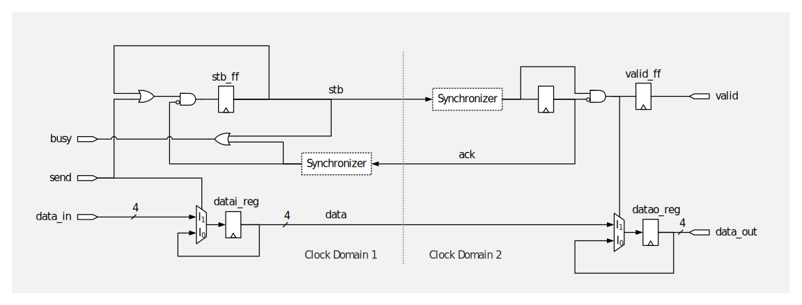

% Case Example
% Ghaith Tarawneh
% 28/4/2016

#### Case Example: _Sender/Receiver Circuit_

The following circuit is used to demonstrate how Xprova works.

This is a simple sender/receiver circuit that transfers a data item across a
clock domain boundary using a handshake. The circuit works as follows:

1. A data item is made available on `data_in` and `send` is asserted.
2. `busy` is asserted and the sender (clock domain 1) initiates the handshake.
3. The receiver (clock domain 2) latches the data item and
asserts `valid` to indicate that `data_out` contains a data item.
4. The handshake completes the sender de-asserts `busy`.

We wrote three SystemVerilog assertions to verify that this circuit works
correctly:

1. `as_correct_transfer`: when `valid` is asserted, the received item equals
the sent item.
2. `as_no_blocked_transfer`: if `send` is asserted then `valid` must be
asserted afterwards (in finite time).
3. `as_sender_handshake`: if `send` is asserted, `busy` must be asserted on
the following cycle.

#### Verification Results

We ran a series of formal verification runs to determine whether the augmented
netlist generated by Xprova can reproduce the CDC errors we know exist from
theory and (equally important) function correctly when no CDC issues are
present. For each verification run we tested whether any of the assertions we
specified  can be violated. The results for both source and augmented netlists
are tabulated below (alongside what we know from theory).

<table class="mytable  mdl-shadow--2dp">
<tr>
<th>Synchronizer(s)</th>
<th>Assertion</th>
<th style='width: 20%;'>Source Netlist</th>
<th style='width: 20%;'>Augmented Netlist</th>
<th style='width: 20%;'>Theory</th>
</tr>
<tr>
<td rowspan="3">None</td>
<td><code>as_correct_transfer</code></td>
<td>PASS</td>
<td>FAIL</td>
<td>FAIL</td>
</tr>
<tr>
<td><code>as_no_blocked_transfer</code></td>
<td>PASS</td>
<td>FAIL</td>
<td>FAIL</td>
</tr>
<tr>
<td><code>as_sender_handshake</code></td>
<td>PASS</td>
<td>FAIL</td>
<td>FAIL</td>
</tr>
<tr>
<td rowspan="3">Sender Only</td>
<td><code>as_correct_transfer</code></td>
<td>PASS</td>
<td>FAIL</td>
<td>FAIL</td>
</tr>
<tr>
<td><code>as_no_blocked_transfer</code></td>
<td>PASS</td>
<td>PASS</td>
<td>PASS</td>
</tr>`
<tr>
<td><code>as_sender_handshake</code></td>
<td>PASS</td>
<td>FAIL</td>
<td>FAIL</td>
</tr>
<tr>
<td rowspan="3">Receiver Only</td>
<td><code>as_correct_transfer</code></td>
<td>PASS</td>
<td>FAIL</td>
<td>FAIL</td>
</tr>
<tr>
<td><code>as_no_blocked_transfer</code></td>
<td>PASS</td>
<td>FAIL</td>
<td>FAIL</td>
</tr>
<tr>
<td><code>as_sender_handshake</code></td>
<td>PASS</td>
<td>FAIL</td>
<td>FAIL</td>
</tr>
<tr>
<td rowspan="3">Both</td>
<td><code>as_correct_transfer</code></td>
<td>PASS</td>
<td>PASS</td>
<td>PASS</td>
</tr>
<tr>
<td><code>as_no_blocked_transfer</code></td>
<td>PASS</td>
<td>PASS</td>
<td>PASS</td>
</tr>
<tr>
<td><code>as_sender_handshake</code></td>
<td>PASS</td>
<td>PASS</td>
<td>PASS</td>
</tr>
</table>

In short, running formal verification on the source netlist resulted in all
assertions receiving a PASS status whether
synchronizers were present or not. _This is of course incorrect_ (we know from
theory that the lack of a receiver synchronizer, for one, can cause data
corruption and hence violations of `as_correct_transfer`). On the other hand,
formal verification results on the augmented netlist were identical to what we
know theoretically.

Note that although the lack of one or both synchronizers results in violations
of most assertions, the lack of a receiver synchronizer does not cause any
violations of `as_no_blocked_transfer`. Missing the receiver synchronizer does
not affect the sender's ability to assert `busy` following an assertion of
`send` since the sender state flip-flop is protected from becoming metastable
by the presence of the sender synchronizer. This demonstrates an important
feature of the proposed workflow: the ability to correctly identify correct
behavior. As mentioned in [Overview](overview.htm), false positives are a
major challenge in CDC verification and a good CDC verification tool must be
just as capable of recognizing when issues are _not_ present, even if standard
design practices are not followed.
