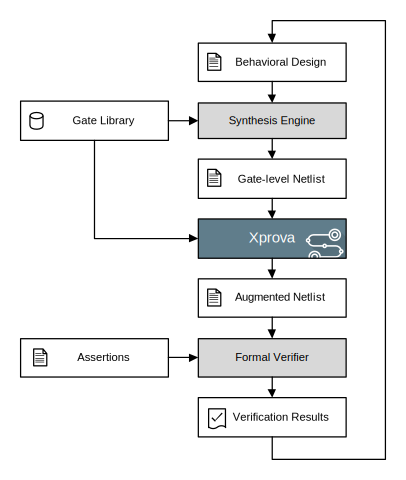

% Formal Verification
% Ghaith Tarawneh
% 28/4/2016

#### Combining with Formal Verification

Xprova can be combined with formal verification  to create a very potent CDC
verification and debugging workflow. This can be done by adding the tool as a
netlist preprocessing step before formal verification as shown below:

This integration does not require modifying any other parts of the tool chain and can be made completely transparent to the designer.

See our [Case Example](example.htm) for an illustration of this workflow in action.

