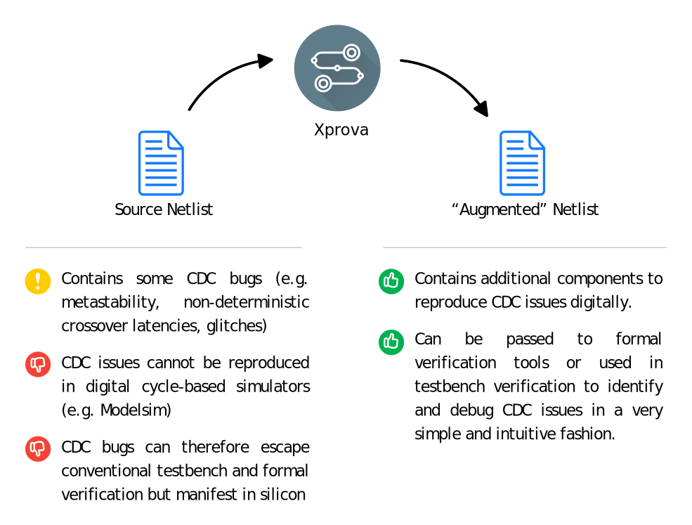

% Overview
% Ghaith Tarawneh
% 28/4/2016

#### Introduction

This website describes a novel EDA tool (Xprova) and associated
methodology for verifying Clock Domain Crossing (CDC) circuits.[^ref_c] We
presented the methodology and a demo of Xprova at DATE2016 and are now
collecting feedback from industrial partners to drive the development of the
tool forward.

The contents of this website are based on the following resources which may be
downloaded for further details:

* DATE 2016 Paper (PDF) : [Local Download](./downloads/cdc_verification_date2016.pdf) or from [IEEE Xplore](http://ieeexplore.ieee.org/xpls/abs_all.jsp?arnumber=7459466)
* [DATE 2016 University Booth Poster (PDF)](./downloads/date2016_demo_portrait_ver3.pdf)
* [DATE 2016 Talk Slides (PowerPoint)](./downloads/date2016_formal_verification.pptx)

#### The Basic Idea

The main difficulty with verifying and debugging CDC logic is that
metastability and several other CDC issues _can not be observed in digital
simulation_. Ever since CDC verification tools were first developed in the
early 2000s, the conventional approach to CDC verification has been to check
designs against lists of structural and functional "rules of thumb" (e.g.
using synchronizers to re-time asynchronous control signals safely) and print
warnings when violations are detected. This approach is safe but reports a
considerably large number of false positives.[^ref_a] [^ref_b]

Xprova circumvents this and other limitations of conventional CDC verification
by targetting the root cause at the heart of CDC verification trouble: the
invisibility of metastability and other CDC issues in digital simulation. The
tool transforms a gate-level netlist into an "augmented" netlist that is
capable of simulating metastability and other CDC issues. The augmented
netlist can be used in testbench or formal verification to identify and debug
CDC failures in a straight-forward and intuitive fashion.

#### Why is it better?

1. **Fewer False Positives**: the tool avoids the need to use conservative
structural and functional heuristics to report when issues _may_ be present.
This reduces false positive warnings and saves valuable verification time.

2. **Zero Configuration**: The tool does not require the designer to specify
how their design is intended to work (e.g. what synchronization scheme or
handshaking protocol is needed) or to specify exceptions to typical design
patterns (e.g. when synchronization is not needed because, say, crossover
signals carry configuration bits which do not change during runtime).

3. **Applicable to Non-standard Design Cases**: The tool is not limited to
stereotypical design patterns and enables designers to explore arbitrary
design ideas including those that violate safe design practices.

4. **Capable of Demonstrating Failure Consequences and Mechanics**:
Conventional tools have little/no support for demonstrating _how_ designs may
fail due to CDC issues. Combining our tool with formal verification yields a
very powerful issue identification and debugging tool that allows designers to
trace the root causes of CDC failures in signal waveforms.

#### How does it work?

The netlist transformation applied by Xprova consists of two steps:

1. **Flip-flops are replaced with models** that can simulate (a) setup/hold
time violations, (b) non-deterministic inputs/outputs and (c) prolonged clk-
to-q delays.

2. **Additional combinational gates are added** to simulate the transfer of
timing violations between FF models.

We found that simulating the onset, logical masking, non-determinism and
propagation of metastable states is sufficient to model a wide variety of CDC
design issues. Our initial verification experiments on a number of test
circuits demonstrated that this approach is inherently capable of recognizing
several CDC design issues including:

1. Missing synchronizers
2. Data corruption
3. Non-deterministic synchronization latency
4. Glitch formation in crossover logic
5. Path reconvergence

Have a look at the [Formal Verification](formal.htm) section to see how Xprova
can be integrated into a formal verification flow to idenfity and debug CDC
issues.

[^ref_a]: Sarwary, Shaker. "[Solving the toughest problems in CDC analysis.](http://www.eetimes.com/document.asp?doc_id=1276024)" EE Times August 28 (2006).
[^ref_b]: Lee, Youngchan, et al. "[Millions to thousands issues through knowledge based SoC CDC Verification.](http://ieeexplore.ieee.org/xpls/abs_all.jsp?arnumber=6407123&tag=1)" SoC Design Conference (ISOCC), 2012 International. IEEE, 2012.
[^ref_c]: Tarawneh, Ghaith, Andrey Mokhov, and Alex Yakovlev. "[Formal verification of clock domain crossing using gate-level models of metastable flip-flops.](http://ieeexplore.ieee.org/xpls/abs_all.jsp?arnumber=7459466)" 2016 Design, Automation & Test in Europe Conference & Exhibition (DATE). IEEE, 2016.